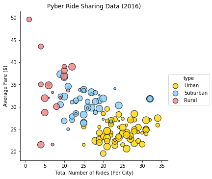
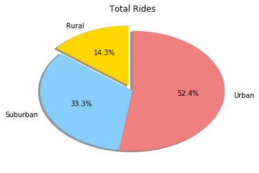
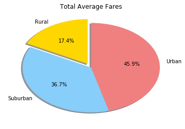
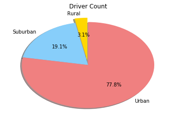

```python
import matplotlib.pyplot as plt
from matplotlib import pyplot
import numpy as np
import os
import pandas as pd
import seaborn
```


```python
#Retrieve Files
csv1 = os.path.join('raw_data', 'city_data.csv')
csv2 = os.path.join('raw_data','ride_data.csv')
```


```python
#Read Files
csv1_df = pd.read_csv(csv1, encoding='ISO-8859-1')
csv2_df = pd.read_csv(csv2, encoding='ISO-8859-1')
```


```python
#Total Number of Rides
total=csv2_df['city'].value_counts()

total1=total.to_frame(name=None)

csv_count=total1.reset_index()

csv_count=csv_count.rename(columns={'index':'city','city':'count'})

csv_count.head()
```


<div>
<style scoped>
    .dataframe tbody tr th:only-of-type {
        vertical-align: middle;
    }

    .dataframe tbody tr th {
        vertical-align: top;
    }

    .dataframe thead th {
        text-align: right;
    }
</style>
<table border="1" class="dataframe">
  <thead>
    <tr style="text-align: right;">
      <th></th>
      <th>city</th>
      <th>count</th>
    </tr>
  </thead>
  <tbody>
    <tr>
      <th>0</th>
      <td>Swansonbury</td>
      <td>34</td>
    </tr>
    <tr>
      <th>1</th>
      <td>Port Johnstad</td>
      <td>34</td>
    </tr>
    <tr>
      <th>2</th>
      <td>Port James</td>
      <td>32</td>
    </tr>
    <tr>
      <th>3</th>
      <td>South Louis</td>
      <td>32</td>
    </tr>
    <tr>
      <th>4</th>
      <td>Alvarezhaven</td>
      <td>31</td>
    </tr>
  </tbody>
</table>
</div>


```python
#Clean Data
csv3=csv2_df.drop(columns=['date','ride_id'])

csv3.head()
```


<div>
<style scoped>
    .dataframe tbody tr th:only-of-type {
        vertical-align: middle;
    }

    .dataframe tbody tr th {
        vertical-align: top;
    }

    .dataframe thead th {
        text-align: right;
    }
</style>
<table border="1" class="dataframe">
  <thead>
    <tr style="text-align: right;">
      <th></th>
      <th>city</th>
      <th>fare</th>
    </tr>
  </thead>
  <tbody>
    <tr>
      <th>0</th>
      <td>Sarabury</td>
      <td>38.35</td>
    </tr>
    <tr>
      <th>1</th>
      <td>South Roy</td>
      <td>17.49</td>
    </tr>
    <tr>
      <th>2</th>
      <td>Wiseborough</td>
      <td>44.18</td>
    </tr>
    <tr>
      <th>3</th>
      <td>Spencertown</td>
      <td>6.87</td>
    </tr>
    <tr>
      <th>4</th>
      <td>Nguyenbury</td>
      <td>6.28</td>
    </tr>
  </tbody>
</table>
</div>


```python
#Find Average Ride Costs
csv4=csv3.groupby(['city'],as_index=False).mean()

csv4.head()
```


<div>
<style scoped>
    .dataframe tbody tr th:only-of-type {
        vertical-align: middle;
    }

    .dataframe tbody tr th {
        vertical-align: top;
    }

    .dataframe thead th {
        text-align: right;
    }
</style>
<table border="1" class="dataframe">
  <thead>
    <tr style="text-align: right;">
      <th></th>
      <th>city</th>
      <th>fare</th>
    </tr>
  </thead>
  <tbody>
    <tr>
      <th>0</th>
      <td>Alvarezhaven</td>
      <td>23.928710</td>
    </tr>
    <tr>
      <th>1</th>
      <td>Alyssaberg</td>
      <td>20.609615</td>
    </tr>
    <tr>
      <th>2</th>
      <td>Anitamouth</td>
      <td>37.315556</td>
    </tr>
    <tr>
      <th>3</th>
      <td>Antoniomouth</td>
      <td>23.625000</td>
    </tr>
    <tr>
      <th>4</th>
      <td>Aprilchester</td>
      <td>21.981579</td>
    </tr>
  </tbody>
</table>
</div>


```python
#Final DF
new_df=pd.merge(csv1_df, csv4, on='city')

new_df=pd.merge(new_df, csv_count, on='city')

new_df.head()
```


<div>
<style scoped>
    .dataframe tbody tr th:only-of-type {
        vertical-align: middle;
    }

    .dataframe tbody tr th {
        vertical-align: top;
    }

    .dataframe thead th {
        text-align: right;
    }
</style>
<table border="1" class="dataframe">
  <thead>
    <tr style="text-align: right;">
      <th></th>
      <th>city</th>
      <th>driver_count</th>
      <th>type</th>
      <th>fare</th>
      <th>count</th>
    </tr>
  </thead>
  <tbody>
    <tr>
      <th>0</th>
      <td>Kelseyland</td>
      <td>63</td>
      <td>Urban</td>
      <td>21.806429</td>
      <td>28</td>
    </tr>
    <tr>
      <th>1</th>
      <td>Nguyenbury</td>
      <td>8</td>
      <td>Urban</td>
      <td>25.899615</td>
      <td>26</td>
    </tr>
    <tr>
      <th>2</th>
      <td>East Douglas</td>
      <td>12</td>
      <td>Urban</td>
      <td>26.169091</td>
      <td>22</td>
    </tr>
    <tr>
      <th>3</th>
      <td>West Dawnfurt</td>
      <td>34</td>
      <td>Urban</td>
      <td>22.330345</td>
      <td>29</td>
    </tr>
    <tr>
      <th>4</th>
      <td>Rodriguezburgh</td>
      <td>52</td>
      <td>Urban</td>
      <td>21.332609</td>
      <td>23</td>
    </tr>
  </tbody>
</table>
</div>


```python
d_count=new_df['driver_count']

seaborn.lmplot(x='count',y='fare',data=new_df, hue='type', palette=dict(Urban='gold', Suburban='lightskyblue',Rural='lightcoral'),fit_reg=False, scatter_kws={'s': d_count*3, 'edgecolors':'black'})
plt.title("Pyber Ride Sharing Data (2016)")
plt.xlabel("Total Number of Rides (Per City)")
plt.ylabel("Average Fare ($)")
```


    Text(31.2105,0.5,'Average Fare ($)')





```python
#Total Rides Data
per_df=new_df.groupby('type')
per_df=per_df.count()

per_df=per_df.drop(columns=['driver_count','fare','count'])
per_df=per_df.rename(columns={'city':'counts'})
count_sum=per_df['counts'].sum()
```


```python
#Total Rides Pie
labels = ["Rural", "Suburban", "Urban"]
sizes = [(18/126)*100, (42/126)*100,(66/126)*100]
colors = ["gold", "lightskyblue", "lightcoral"]
explode = [0.1, 0, 0]

plt.pie(sizes, explode=explode, labels=labels, colors=colors,
        autopct='{:.1f}%'.format, shadow=True, startangle=90)
plt.title("Total Rides")
```


    Text(0.5,1,'Total Rides')





```python
#Total Fare Data
total_sum=new_df['fare'].sum()
urban_sum=new_df.loc[new_df['type']=='Urban']['fare'].sum()
suburban_sum=new_df.loc[new_df['type']=='Suburban']['fare'].sum()
rural_sum=new_df.loc[new_df['type']=='Rural']['fare'].sum()
```


```python
#Total Fare Pie
labels = ["Rural", "Suburban", "Urban"]
sizes = [(rural_sum/total_sum)*100, (suburban_sum/total_sum)*100,(urban_sum/total_sum)*100]
colors = ["gold", "lightskyblue", "lightcoral"]
explode = [0.1, 0, 0]

plt.pie(sizes, explode=explode, labels=labels, colors=colors,
        autopct='{:.1f}%'.format, shadow=True, startangle=90)
plt.title("Total Average Fares")
```


    Text(0.5,1,'Total Average Fares')





```python
#Driver Count Data
total_count=new_df['driver_count'].sum()
urban_count=new_df.loc[new_df['type']=='Urban']['driver_count'].sum()
suburban_count=new_df.loc[new_df['type']=='Suburban']['driver_count'].sum()
rural_count=new_df.loc[new_df['type']=='Rural']['driver_count'].sum()
```


```python
#Driver Count Pie
labels = ["Rural", "Suburban", "Urban"]
sizes = [(rural_count/total_count)*100, (suburban_count/total_count)*100,(urban_count/total_count)*100]
colors = ["gold", "lightskyblue", "lightcoral"]
explode = [0.1, 0, 0]

plt.pie(sizes, explode=explode, labels=labels, colors=colors,
        autopct='{:.1f}%'.format, shadow=True, startangle=90)

plt.title("Driver Count")
```


    Text(0.5,1,'Driver Count')




